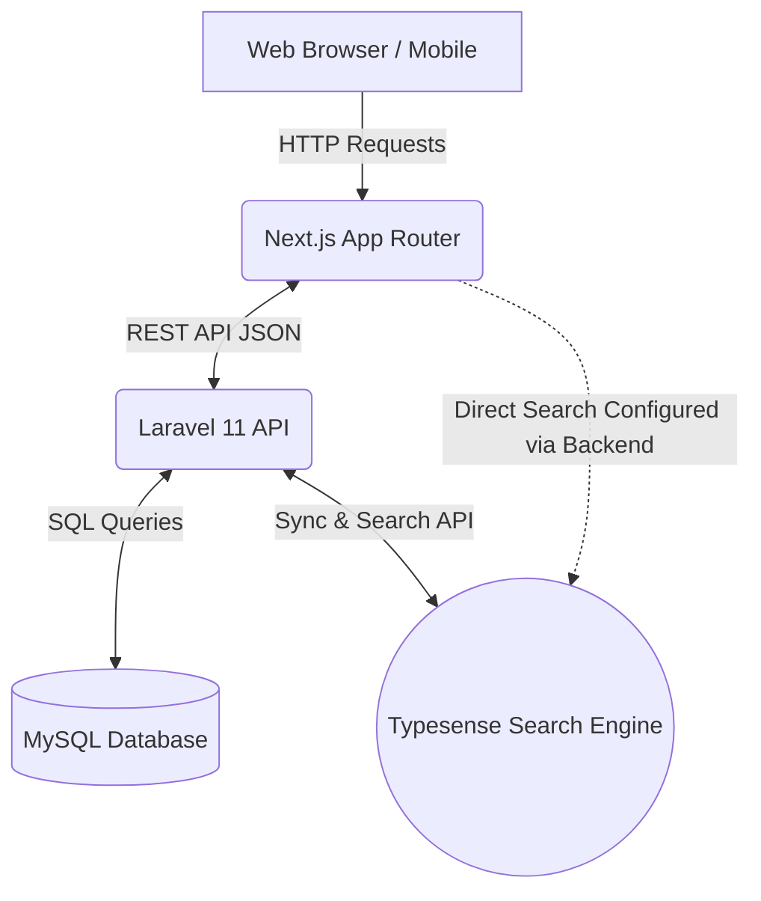
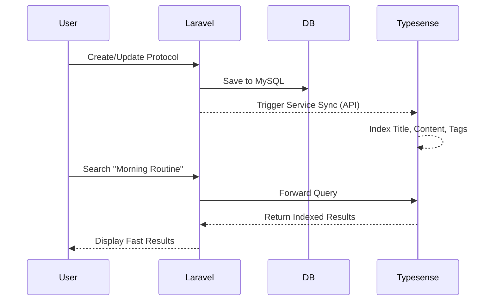
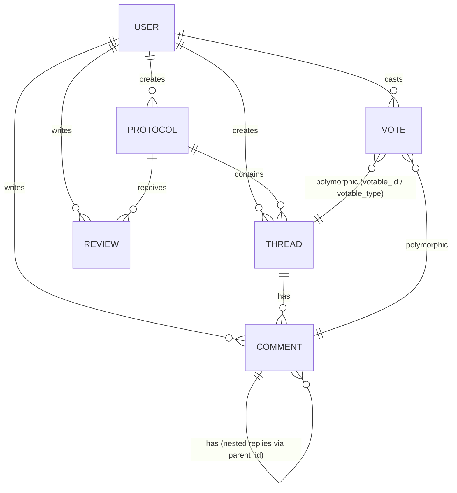

# Holistica - Implementation Notes

## 1. Project Overview
Holistica is a community-driven, full-stack platform designed for sharing, discovering, and discussing healthcare protocols. It serves as a centralized archive of wellness routines where users can engage through comments, reviews, and a voting system. The platform was built with a strong focus on fast search capabilities and a responsive, clean user experience.

---

## 2. Architecture
Holistica is structured as a decoupled monolith. The backend API (Laravel) and frontend SPA (Next.js) live in the same repository but operate independently.

---

## 3. Backend Design
The backend is built with **Laravel 11.x**, serving exclusively as a RESTful JSON API.
- **API Routing:** All endpoints are strictly defined in `routes/api.php` and follow standard REST naming conventions.
- **Authentication:** Laravel Sanctum provides lightweight, token-based authentication for the SPA.
- **Controllers & Validation:** Dedicated controllers handle incoming requests, utilizing Laravel Form Requests to strictly validate incoming data before it touches the models.
- **Resource Classes:** API Resources (`JsonResource`) are used to transform Eloquent models into consistent JSON structures, hiding sensitive internal database details (like hidden timestamps or internal IDs).

---

## 4. Frontend Design
The frontend leverages **Next.js 15.x** using the modern App Router (`src/app`).
- **Styling:** TailwindCSS is used for a utility-first, fully responsive design approach, combined with `shadcn/ui` for accessible primitive components (cards, dialogs, inputs).
- **State Management & Fetching:** React Hooks and local state manage fast UI updates, while standard `fetch` or Axios integrations communicate with the Laravel API.
- **Routing:** Deep nesting and clean URLs are achieved using the App Router's directory-based routing system. Pages dynamically fetch initial data on load.

---

## 5. Typesense Integration
To provide "search-as-you-type" functionality with advanced filtering, **Typesense** is integrated as the primary search engine for Protocols and Threads.

- **Service Layer:** `TypesenseService.php` handles the heavy lifting of defining schemas and indexing documents.
- **Synchronization:** Eloquent model events dynamically trigger when a Protocol or Thread is saved, instantly updating the Typesense cluster so the search remains perfectly in sync with the database.
- **Command Line Tools:** A custom artisan command (`php artisan typesense:reindex`) was built to allow developers to easily wipe and rebuild the entire search index from the database state.

---

## 6. Database Design
The database utilizes MySQL to maintain relational integrity among highly connected user-generated content.

### Key Models:
- **Protocol:** The core entity.
- **Thread:** Discussions tied directly to a `protocol_id`.
- **Comment:** Supports unlimited nesting via a `parent_id` self-referencing column.
- **Review:** A 1-5 rating system tied to a Protocol.
- **Vote (Polymorphic):** Instead of distinct tables for `thread_votes` and `comment_votes`, a single `votes` table uses `votable_id` and `votable_type` to allow users to upvote/downvote either entity cleanly. A unique composite index ensures users can only vote once per item.

---

## 7. Challenges & Decisions
1. **Polymorphic Voting:**
   - **Challenge:** Implementing an upvote/downvote system for multiple different models without duplicate code.
   - **Decision:** Utilized Laravel's polymorphic relations. The `Vote` model attaches to both `Thread` and `Comment`. Laravel's `updateOrCreate` method easily handles vote toggling (changing an upvote to a downvote).
2. **Nested Comments:**
   - **Challenge:** Creating Reddit-style deeply nested comments in a relational database.
   - **Decision:** Added a nullable `parent_id` to the `comments` table.
3. **Typesense vs. Scout:**
   - **Challenge:** Laravel Scout is powerful but sometimes abstracts too much of Typesense's specific config needs.
   - **Decision:** While standard indexing works well, absolute control over the schema creation was implemented manually via `TypesenseService` and the `typesense:reindex` command to ensure filtering by exact stats (like `avg_rating`) worked flawlessly.

---

## 8. Possible Improvements
1. **Server-Side Rendering (SSR) for the Frontend:** Implementing Next.js SSR to fetch protocol details before sending HTML to the client would massively improve SEO for public health guides.
2. **Queueing Typesense Updates:** Currently, Typesense indexing hooks run synchronously. Pushing these to a background queue (Redis) would prevent API bottlenecks during high-traffic periods.
3. **OpenAI Summaries Integration:** Adding an automated background job to summarize long discussion threads using the OpenAI API at the top of popular protocols.
4. **Rate Limiting & Anti-Spam:** Implementing stricter API rate limits and possibly ReCaptcha on the comment and review endpoints to prevent abuse.
